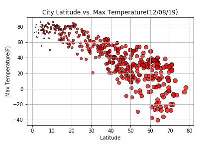
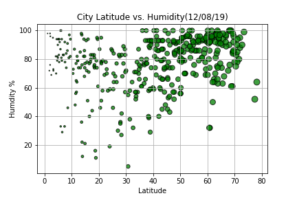
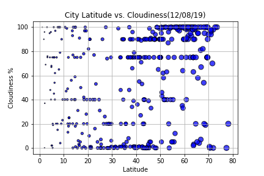
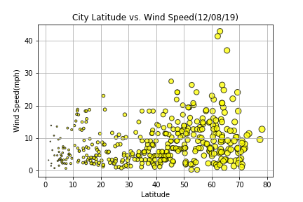

# Python API - What's the Weather Like?

## Background

Whether financial, political, or social -- data's true power lies in its ability to answer questions definitively. In this assignment we answer a fundamental question: "What's the weather like as we approach the equator?"

In this example, we will be creating a Python script to visualize the weather of 500+ cities across the world of varying distance from the equator. To accomplish this, we will be utilizing a [simple Python library](https://pypi.python.org/pypi/citipy), the [OpenWeatherMap API](https://openweathermap.org/api), and a little common sense to create a representative model of weather across world cities.

## Tasks:

Our objective is to build a series of scatter plots to showcase the following relationships:

1. Temperature (F) vs. Latitude
2. Humidity (%) vs. Latitude
3. Cloudiness (%) vs. Latitude
4. Wind Speed (mph) vs. Latitude

Our final notebook :

1. Randomly selects **at least** 500 unique (non-repeat) cities based on latitude and longitude.
2. Performs a weather check on each of the cities using a series of successive API calls.
3. Includes a print log of each city as it's being processed with the city number and city name.
4. Saves both a CSV of all data retrieved and png images for each scatter plot.

## Results:

Temperature (F) vs. Latitude

Humidity (%) vs. Latitude

Cloudiness (%) vs. Latitude

Wind Speed (mph) vs. Latitude

## Observations
Examining the maximum temperature data, there is a clear trend showing a drop in temperature the farther a city is located from the equatorial region. The scatter plot is flat between the latitudes of -20 and 20, but then drops off roughly evenly in both directions until the latitudes of -60 and 60. Beyond that point, it can be assumed that this trend continues to both polar regions, but there is not sufficient data approaching the Antarctic region of the southern hemisphere. This trend is explained by the curvature and tilt of the Earth. The equatorial regions are at the widest part of the planet and aren't as affected by Earth's curvature and tilt relative to the sun. Therefore, they receive more consistent sunlight all year long, which results in higher maximum temperatures. In contrast, cities farther to the north or south receive less sunlight due to the curvature and tilt, which results in lower maximum temperatures.

In regard to the humidity and wind speed data, it is evident that the majority of cities have humidity percentages above 60 percent and wind speeds below 15 miles per hour. In both cases, the scatter plots show the data primarily grouped in those zones, regardless of latitude. Humidity percentages are more likely tied to the climactic region of a particular city and specific weather patterns in that area. Wind speeds could be tied to a city's altitude, surrounding geographical/physical features, and/or current weather systems.

Reviewing the cloudiness data, there is no clear correlation present with respect to latitude. The scatter plot shows a near even distibution of data throughout, although there are some small groupings present. Cloudiness is more dependent on a city's daily weather. For example, a rainy or snowy day would more likely have a higher cloud percentage, while a sunny day would generally have a lower percentage.

